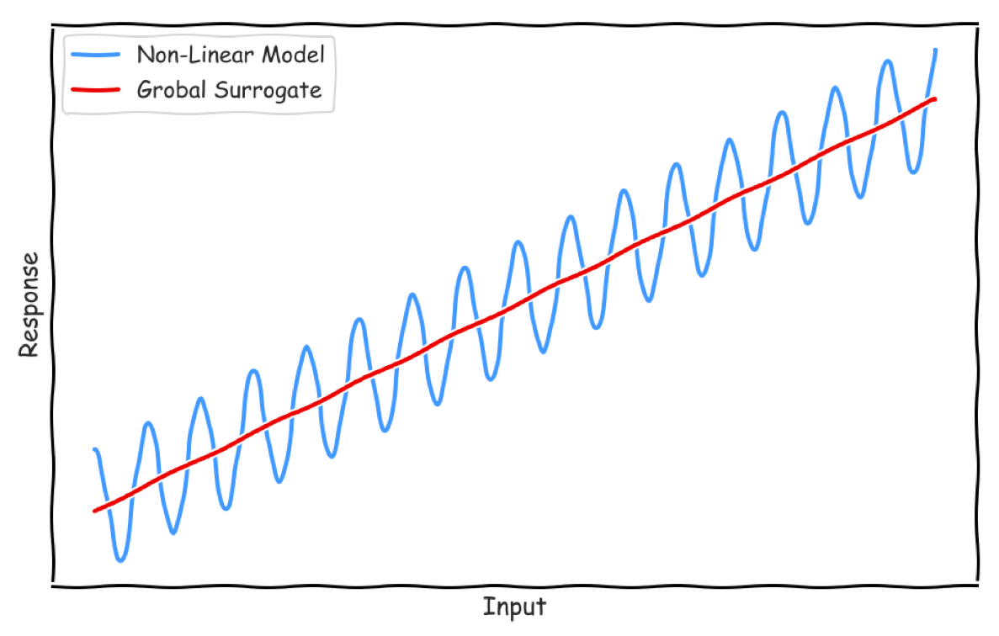
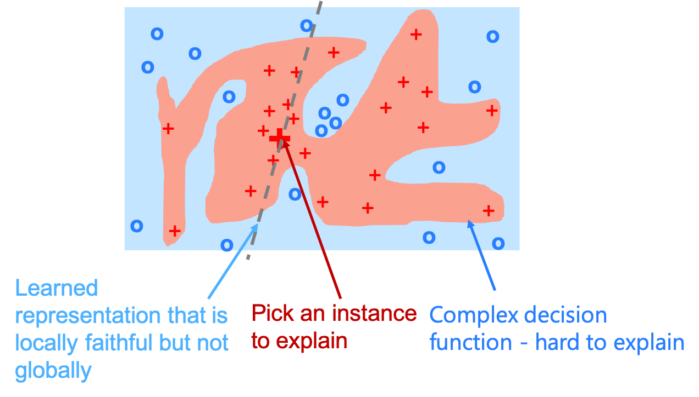
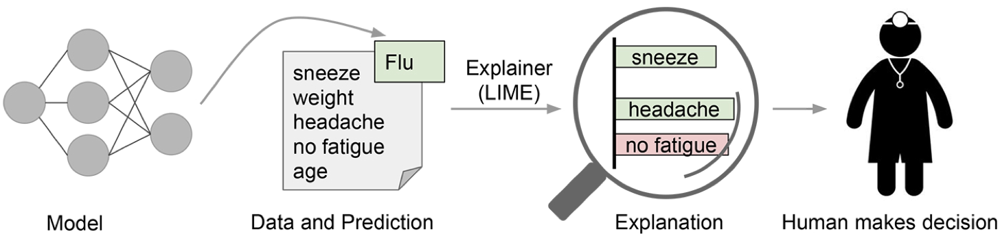
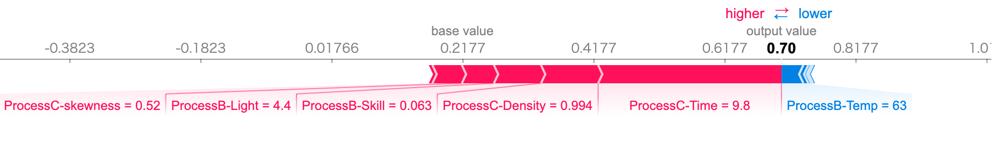

# Model-Agnostic Methods

モデルに依存しない汎用的なモデル解釈の主要アルゴリズムの概要を説明します。ニューラルネットワークなど複雑な Black Boxなモデルに適用できます。 

---

## Global Surrogate
グローバルなモデル解釈方法。構築済みの機械学習モデルに対するインプットデータと予測値から、線形回帰などの解釈可能なモデルで学習し直して、モデル解釈をするアプローチ方法。

 

## Permutation Feature Importance
グローバルなモデル解釈方法。インプットデータを変化させた際の予測値の変化の大きさから、変数の影響度を判断するアプローチ方法。[Random Forest の論文](https://link.springer.com/article/10.1023%2FA%3A1010933404324)で言及されている。
 

## LIME
KDD 2016 で採択されたローカルなモデル解釈手法。ある予測結果について局所的に近似させた解釈可能な機械学習モデルを適用して、そのモデルを解釈するアプローチ方法。

**"Why Should I Trust You?": Explaining the Predictions of Any Classifier**  
https://arxiv.org/abs/1602.04938

 

 

LIME は、個々の予測値についての説明変数の重要度を出力することができます。

  

_Explaining individual predictions_ (論文より引用)

 

## SHAP
NIPS 2017 で採択されたローカルなモデル解釈手法。ゲーム理論のシャープレイ値の枠組みを利用して、変数の影響度を算出している。

**A Unified Approach to Interpreting Model Predictions**  
https://papers.nips.cc/paper/7062-a-unified-approach-to-interpreting-model-predictions

 

  

 
  

SHAP も LIME と同じように、個々の予測値についての説明変数の重要度を出力することができます。

*品質管理モデルの例 ... 赤は不良の確率を増加、青は不良の確率を減少させることを意味する*